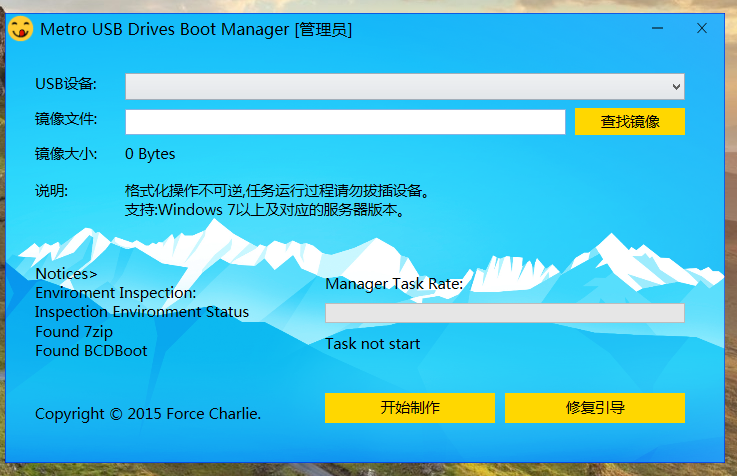

USB Device Boot Burn Manager [](https://github.com/forcegroup/iBurnMgr)
========
iBurnMgr is a 'Modern Style' USB Drives Burn Boot Manager.   
iBurnMgr is developed using C + +, runs on Windows, a production Windows 10 USB installation disk tools   
iBurnMgr used WTL framework, using Direct2D rendering Push Button, close and minimize buttons, and backgrounds, 
functional areas. Text is output using DirectWrite,MessageBox is TaskDialog replaced.    
Format the USB flash drive comes format.com tools rely on Windows, unzip the ISO image using 7z, 
repair USB flash drive using the Windows ADK's bootsect.exe   
In the second edition or third edition, iBurnMgr will eliminate reliance on third-party tools.    

iBurnMgr now Support Multilanguage.

###Internal
1. Format:
```c
BOOL WINAPI  IVdsVolumeFormat(
	LPCWSTR    latter,
	LPWSTR    pwszLabel,
	FormatFailedCallback fcall,
	void *data)
{
	if (!VAILED_LATTER(latter[0]) || latter[1] != ':') return FALSE;
	HRESULT hr, AsyncHr;
	IVdsAsync      *pAsync = NULL;
	VDS_ASYNC_OUTPUT AsyncOut;

	hr = CoInitializeSecurity(
		NULL,
		-1,
		NULL,
		NULL,
		RPC_C_AUTHN_LEVEL_CONNECT,
		RPC_C_IMP_LEVEL_IMPERSONATE,
		NULL,
		0,
		NULL
		);
	IVdsServiceLoader *pLoader;
	IUnknown *pUnk;
	ULONG ulFetched = 0;
	hr = CoCreateInstance(CLSID_VdsLoader,
		NULL,
		CLSCTX_LOCAL_SERVER | CLSCTX_REMOTE_SERVER,
		IID_IVdsServiceLoader,
		(void **)&pLoader
		);
	if (hr != S_OK) return false;
	IVdsService *pService;
	hr = pLoader->LoadService(NULL, &pService);
	pLoader->Release();
	pLoader = NULL;
	if (hr != S_OK){
		if (fcall){
			fcall(ErrorCodesMessage(hr), data);
		}
		return FALSE;
	}
	VDS_DRIVE_LETTER_PROP mDriveLetterPropArray[1];
	hr = pService->QueryDriveLetters(latter[0], 1, mDriveLetterPropArray);
	if (hr != S_OK){
		goto _bailout;
	}
	hr = pService->GetObjectW(mDriveLetterPropArray->volumeId, VDS_OT_VOLUME, &pUnk);
	if (hr != S_OK){
		goto _bailout;
	}
	IVdsVolume *pVolume;
	hr = pUnk->QueryInterface(IID_IVdsVolume, (void **)&pVolume);
	if (hr != S_OK){
		SAFE_RELEASE(pUnk);
		goto _bailout;
	}
	IVdsVolumeMF3 *pVolumeMF3;
	hr = pVolume->QueryInterface(IID_IVdsVolumeMF3, (void **)&pVolumeMF3);

	hr = pVolumeMF3->FormatEx2(L"NTFS", 1, 0, pwszLabel, VDS_FSOF_QUICK, &pAsync);
	hr = pAsync->Wait(&AsyncHr, &AsyncOut);
	if (FAILED(hr)){
		if (fcall){
			fcall(ErrorCodesMessage(hr), data);
		}
	}
	else if (FAILED(AsyncHr)){
		if (fcall){
			fcall(ErrorCodesMessage(hr), data);
		}
	}
	else{
		if (fcall){
			fcall(L"Format volume Success done. ", data);
		}
	}
	SAFE_RELEASE(pVolume);
	SAFE_RELEASE(pVolumeMF3);
_bailout:
	SAFE_RELEASE(pService);
	CoUninitialize();
	return hr==S_OK;
}
```

2. Uncompress ISO:
>7z x file.iso -aoa -y -o X:\

3. Boot:
>bootsect /NT60 X:


###Build
run WDExpress [VisualStudio 2012(2013) for Desktop] 
or Type:
> msbuild iBurnMgr.sln /t:Rebuild /p:Configuration=Release

###Run
last double click iBurnMgr.exe ,or Right-to run with administrator privileges.

Good Luck!


####Screenshot
Format Disk Warning:       


Create BootUSB Success:      


Create Faild:      


NewUI:     


Chinese UI:       

