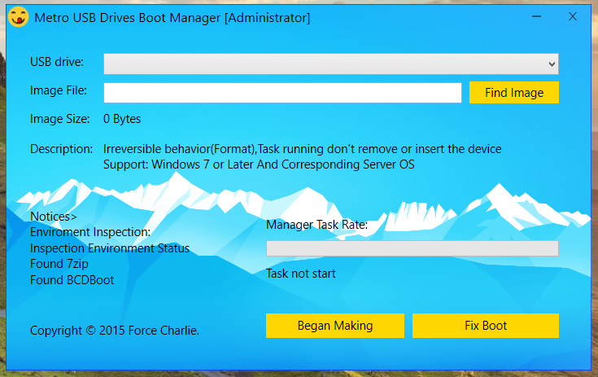

USB Device Boot Burn Manager 
========
iBurnMgr is a 'Metro Style' USB Drives Burn Boot Manager.

iBurnMgr is developed using C + +, runs on Windows, a production Windows 7+ USB installation disk tools

iBurnMgr used WTL framework, using Direct2D rendering Push Button, close and minimize buttons, and backgrounds, functional areas. Text is output using DirectWrite,MessageBox is TaskDialog replaced.

Format the USB flash drive comes format.com tools rely on Windows, unzip the ISO image using 7z, repair USB flash drive using the Windows ADK's bootsect.exe

In the second edition or third edition, iBurnMgr will eliminate reliance on third-party tools.

iBurnMgr now Support Multilanguage.

###Build
run WDExpress [VisualStudio 2012(2013) for Desktop] 
or Type:
> msbuild iBurnMgr.sln /t:Rebuild /p:Configuration=Release

###Run
last double click iBurnMgr.exe ,or Right-to run with administrator privileges.

Good Luck!

####Screenshot
**Format Disk Warning**

**Create BootUSB Success**

**Create Faild**

**NewUI**

**Chinese UI**

